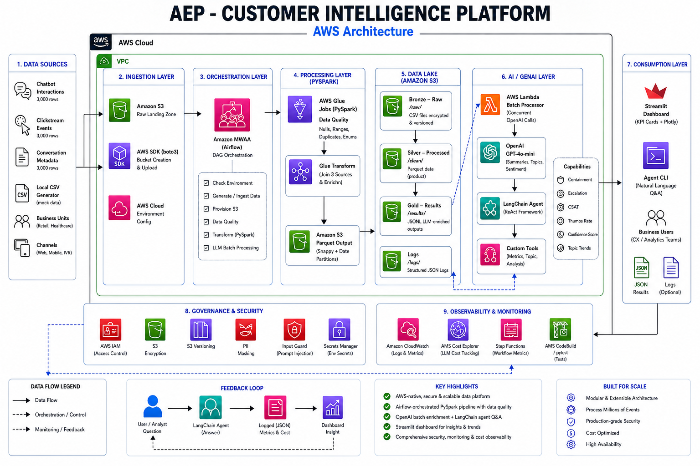

# AEP Customer Intelligence Platform

An **AWS-native, AI-powered data pipeline** that unifies enterprise customer
interaction data and serves a conversational AI agent for real-time business
insights — simulating a production Adobe Experience Platform (AEP) deployment.

Built as a portfolio project demonstrating skills in **cloud data engineering,
LLM orchestration, agentic AI, and production-grade Python**.

---

## Architecture



---

## Tech Stack

| Layer              | Technology                                          |
|--------------------|-----------------------------------------------------|
| Cloud Storage      | AWS S3 (versioning + AES-256 encryption)            |
| Orchestration      | Apache Airflow 2.x (daily DAG)                      |
| Data Processing    | PySpark 3.5 (data quality + Glue-style transform)   |
| Data Format        | Apache Parquet (snappy compressed, date-partitioned)|
| LLM               | OpenAI GPT-4o-mini (batch, concurrent calls)        |
| Agent Framework    | LangChain ReAct agent + custom tools                |
| Dashboard          | Streamlit + Plotly                                  |
| Security           | Custom input guard (injection detection + PII mask) |
| Observability      | Structured JSON logging + LLM cost tracker          |
| Infrastructure     | boto3 (S3 provisioning)                             |
| Testing            | pytest (unit tests, no external calls)              |
| Config             | python-dotenv                                       |

---

## Project Structure

```
aep-customer-intelligence-platform/
│
├── data/
│   └── raw/
│       ├── generate_mock_data.py      # 3 sources × 3,000 rows each
│       ├── chatbot_interactions.csv   # generated
│       ├── clickstream_events.csv     # generated
│       └── conversation_metadata.csv # generated
│
├── infrastructure/
│   └── aws_setup.py                  # S3 bucket creation + upload
│
├── pipeline/
│   ├── data_quality.py               # PySpark DQ checks
│   ├── glue_transform.py             # PySpark join & enrich → Parquet
│   └── airflow_dag.py                # Airflow DAG (daily orchestration)
│
├── llm/
│   ├── prompt_templates.py           # Versioned prompt registry
│   └── batch_processor.py           # Concurrent OpenAI batch processor
│
├── agent/
│   ├── tools/
│   │   ├── metrics_tool.py           # LangChain KPI metrics tool
│   │   └── topic_tool.py             # LangChain trending topics tool
│   └── query_agent.py               # LangChain ReAct agent
│
├── security/
│   └── input_guard.py               # Injection detection + sanitization
│
├── observability/
│   └── logger.py                    # JSON logging + cost tracking
│
├── dashboard/
│   └── app.py                       # Streamlit dashboard + AI chat
│
├── tests/
│   └── test_pipeline.py             # pytest unit tests
│
├── .env.example                     # Environment variable template
├── requirements.txt
└── README.md
```

---

## Data Model

### Source 1: `chatbot_interactions`
Turn-level chatbot exchange records.

| Field | Type | Description |
|-------|------|-------------|
| `contact_id` | string | Unique customer identifier |
| `session_id` | string | Conversation session ID |
| `topic_name` | string | Classified conversation topic |
| `confidence_score` | float [0,1] | NLU confidence in bot response |
| `response_type` | string | FAQ / Guided Flow / Free Text / Escalation |
| `thumbs_up` | int {0,1} | Positive feedback flag |
| `thumbs_down` | int {0,1} | Negative feedback flag |
| `escalated_to_agent` | int {0,1} | Whether turn triggered escalation |
| `business_unit` | string | Retail / Healthcare / etc. |
| `application_channel` | string | Web / Mobile App / IVR / etc. |
| `handle_seconds_dur` | int | Turn handle time in seconds |
| `derived_resolution_score` | float [0,1] | Composite resolution quality score |

### Source 2: `clickstream_events`
Web/app behavioral events per session.

### Source 3: `conversation_metadata`
Session-level aggregates: CSAT, containment, language, queue.

---

## Key Metrics

| Metric | Definition |
|--------|-----------|
| **Containment Rate** | % of sessions resolved without human escalation |
| **Escalation Rate** | % of sessions/turns handed off to a live agent |
| **Thumbs-Up Rate** | Positive feedback / total rated turns |
| **Resolution Score** | Composite: confidence × 0.5 + feedback + containment |
| **CSAT Score** | Customer satisfaction 1–5 (session-level) |
| **Avg Confidence** | Mean NLU model confidence score across turns |

---

## Setup

### Prerequisites
- Python 3.11+
- Java 11+ (for PySpark)
- AWS credentials configured (`aws configure` or env vars)
- OpenAI API key

### 1. Clone & install

```bash
git clone https://github.com/Ilamparithi-Elango/aep-customer-intelligence-platform.git
cd aep-customer-intelligence-platform
pip install -r requirements.txt
```

### 2. Configure environment

```bash
cp .env.example .env
# Edit .env and fill in your values
```

```env
OPENAI_API_KEY=sk-...
AWS_REGION=us-east-1
AWS_S3_BUCKET=aep-customer-intelligence-platform
```

### 3. Generate mock data

```bash
python data/raw/generate_mock_data.py
# Writes 3 CSV files to data/raw/ (~9,000 rows total)
```

### 4. Provision AWS infrastructure

```bash
python infrastructure/aws_setup.py
# Creates S3 bucket with encryption + versioning, uploads CSVs
# Add --dry-run to preview without executing
```

### 5. Run PySpark pipeline locally

```bash
# Data quality checks
spark-submit --master local[*] pipeline/data_quality.py \
  --chatbot    data/raw/chatbot_interactions.csv \
  --clickstream data/raw/clickstream_events.csv \
  --metadata   data/raw/conversation_metadata.csv

# Transform (local mode)
spark-submit --master local[*] pipeline/glue_transform.py --local
```

### 6. Run LLM batch processor

```bash
python llm/batch_processor.py --local --limit 50
# Processes 50 records using OpenAI API; writes results/llm_results.jsonl
```

### 7. Launch the dashboard

```bash
streamlit run dashboard/app.py
# Opens at http://localhost:8501
```

### 8. Query the AI agent (CLI)

```bash
python agent/query_agent.py --question "What is the containment rate for Retail?"
python agent/query_agent.py  # interactive mode
```

### 9. Run tests

```bash
pytest tests/ -v
```

---

## Example Agent Queries

```
"What is the overall containment rate?"
→ The overall containment rate is 74.8% across all sessions.

"Which topic has the highest escalation rate?"
→ Technical Troubleshooting has the highest escalation rate at 28.3%, followed
  by Returns & Refunds at 22.1%.

"What is the thumbs-up rate on Mobile App?"
→ On Mobile App, the thumbs-up rate is 67.4% (of rated turns).

"Show me the top 3 topics for Healthcare sorted by escalation."
→ For Healthcare:
  1. Technical Troubleshooting – 31.2% escalation rate
  2. Returns & Refunds – 24.8% escalation rate
  3. Billing Inquiry – 18.5% escalation rate

"What is the average confidence score this week?"
→ The average NLU confidence score is 0.7214.
```

---

## Pipeline Orchestration (Airflow)

The Airflow DAG `aep_customer_intelligence_pipeline` runs daily at **02:00 UTC**:

```
check_env → generate_mock_data → provision_aws
         → data_quality_checks → glue_transform
         → llm_batch_process   → notify_success
```

Copy `pipeline/airflow_dag.py` to your Airflow `dags/` directory and set the
`AEP_PROJECT_ROOT` environment variable to the project path.

---

## Security

- **Prompt injection protection**: regex-based detection of 15+ injection patterns
- **PII masking**: API keys, SSNs, email addresses redacted in all log output
- **Input length limits**: 500-character cap on agent questions
- **Categorical allowlists**: business unit and channel values validated against enum
- **S3 hardening**: server-side AES-256 encryption, versioning, public access blocked

---

## Observability

All components use structured JSON logging compatible with AWS CloudWatch
Logs Insights:

```json
{
  "timestamp": "2026-04-06 14:23:01",
  "level": "INFO",
  "logger": "glue_transform",
  "message": "Write complete.",
  "service": "aep-customer-intelligence-platform",
  "step": "glue_transform",
  "elapsed_seconds": 12.4
}
```

LLM cost tracking records token usage and USD cost per call, per model, with
session-level summaries.

---

## License

MIT License. See [LICENSE](LICENSE).
